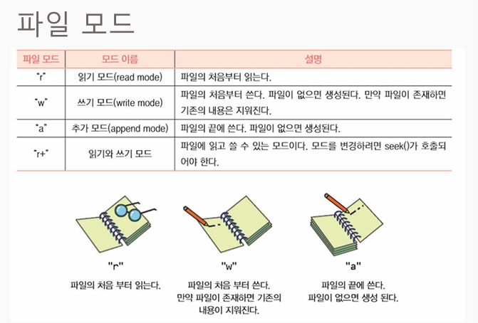

# 파일

## 파일 열고 닫기

```
infile = open("파일이름.txt", "모드")  # 1. 파일 열기 (객체 생성)
# ... 데이터 읽기(read) 또는 쓰기(write) 작업 수행 ...
infile.close()                        # 2. 파일 닫기 (메모리 해제)
```

파일모드
- r : 읽기모드 : 처음부터 읽는다
- w : 쓰기모드 : 파일의 처음부터 쓴다, 파일이 없으면 생성. 존재하면 기존 내용삭제
- a : 추가 모드 : 파일의 끝에 쓴다. 파일이 없으면 생성.
- r+ : 읽기와 쓰기 모드 : 파일을 읽고 쓸 수 있는 모드. 모드를 변경하려면 seek()가 호출되어야 함.




## 파일에서 읽을 때 사용하는 함수.

1) .read()특징: 파일의 전체 텍스트를 하나의 거대한 문자열(String)로 통째로 가져옵니다.    
결과: "홍길동 010-1234-5678\n김철수 010-1234-5679"  

2) .readlines()특징: 파일의 줄바꿈(\n)을 기준으로 쪼개어, 각 줄을 원소로 가지는 리스트(List) 형태로 반환합니다.  
결과: ['홍길동 010-1234-5678\n', '김철수 010-1234-5679\n']   

3) for line in 파일객체: (★9번 빈칸 문제 출제 1순위 🎯)  
특징: 파일 객체를 반복문에 직접 넣으면, 메모리를 아끼면서 한 줄씩 문자열로 순서대로 꺼내옵니다.  

## 파일에서 쓸 때 사용하는 함수.

1) .write()특징 : 
    - w 모드에서는 파일 전체를 다시 쓴다.
    - a 모드에서는 파일의 끝에다가 추가로 쓴다.

## 파일에 데이터 추가하기

```
infile = open("phones.txt", "r")

for line in infile:
    line = line.rstrip()
    word_list = line.split()
    for word in word_list:
        print(word)
infile.close()

```

1. infile 과 텍스트파일을 연결
2. infile에서 한줄씩 가지고옴. (여기서 포문이 알아서 \n기준으로 가지고옴.)
3. 한줄씩 가지고 온것을 오른쪽의 띄어쓰기,줄바꿈 정리
4. 워드리스트에 띄어쓰기 기준으로 나눠서 넣음.
5. 다시 포문으로 4번으로 나눈 것을 단어 하나씩 불러와서
6. 단어 하나씩 출력.
7. 다 완성했으니 연결통로 닫기.


## csv 파일 처리하기

- csv파일 처리방법1  
csv리더를 이용해 데이터를 불러오고 그 데이터의 헤더 부분만 뽑아낸후 포문으로 한줄씩 프린트.
```
import csv

f = open("weather.csv")
data = csv.reader(f)
header = next(data)
for row in data:
    print(row)
f.close()
```

- csv파일 처리방법2  
이 코드는 csv리더를 불러오지않고 바로 스플릿을 이용해 ,를 기준으로 나눠서 프린트함.
```
f = open("weather.csv")
header = next(data)

for line in f:
    word_list = line.rstrip().split(",")
    print(word_list)
f.close()
```
