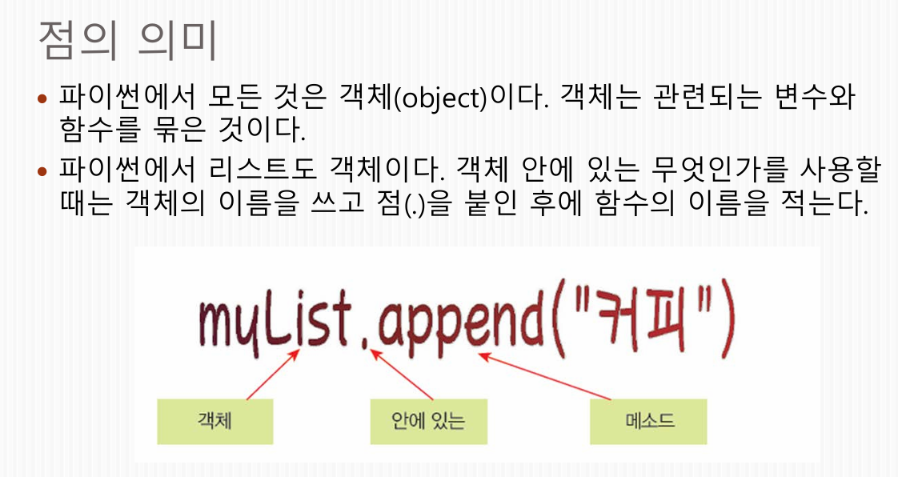

# 리스트

## 리스트의 선언법!

변수명 = [ "변수1", "변수2", "변수3", "변수4"]
이렇게 선언함.

> myList = ["우유", "사과", "두부", "소고기"]

## len(myList)
myList의 길이를 알 수 있음.

> if "우유" in myList:   
>     a = "우유"

이렇게 변수 in 리스트 : 를 이용해서 ~~가 @@안에 있는지 확인가능.

> for i in range(len(myList)):  
>     print(myList[i])

이렇게 포문으로 활용해서 각각 뽑을 수 도 있음.

## 리스트에서 사용되는 함수 몇가지.
.append(변수명) 는 리스트에 추가하는 함수.  
.insert(인덱스번호, 변수명) 은 리스트에 특정 위치에 추가할 수 있음.  
.remove(변수명) 는 변수를 삭제하는 함수.
.pop(인덱스번호) 는 인덱스번호를 뽑아내는 것임. 추출 이라고 이해.  

## .의 의미는 
객체 접근 연산자이다. 특정 객체 내부에 포함된 변수나 함수에 접근하여 이를 호출하거나 사용할때 사용한다.

## 리스트 합치고, 곱하기
>myList = ["유유", "사과"]  
>yourList = ["두부", 소고기"]  
>myList + yourList 

>["유유", "사과", "두부", 소고기"] 

이렇게 결과값이 나옴.  
두 리스트를 이렇게 합칠 수 있음.

>myList = ["유유", "사과"]  
>myList * 2

>["유유", "사과", "유유", "사과"] 

곱하면 이렇게 두번 나옴.

## 슬라이싱

리스트에서 한번에 범위를 지정해서 추출할 수 있다.

>letter = [a, b, c, d, e, f]  
>print(letter[1:3])

>[b, c]

이렇게 1번인덱스부터 3번의 전 인덱스까지 즉 2번인덱스까지 나온다.

>letter = [a, b, c, d, e, f]  
>print(letter[:3])

>[a, b, c]

이렇게 생략할 수 도 있다.

## 정렬

.sort()     원본에 영향을 미쳐 직접 정렬
sorted()    원본에 영향을 미치지 않고 새로운 정렬 리스트 생성.

# 딕셔너리

## 딕셔너리 생성법.

> phone_book = {"키1" : "키값1", "키2" : "키값2"}

이렇게 생성하고 탐색할 때는.

> phone_book["키1"]

의 결과값은 
> "키값1"
이렇게 나옴.

## 딕셔너리에서 변경

> phone_book = {"키1" : "키값1", "키2" : "키값2"}  
> phone_book["키1"] = "1111"

의 결과 값은 
> 키1 의 결과 값은 "키값1"에서 "1111" 로 바뀜.

## 딕셔너리에서 동적으로 항목추가 

> phone_book = {}  
> phone_book["홍길동"] = 1111    
> phone_book  

위의 코드의 결과값은 
> {"홍길동" : 1111} 이다.

## 딕셔너리의 키와 발류값 출력하는 법.

> my_dict = {"name": "철수", "age": 20, "city": "서울"}  
> keys_result = my_dict.keys()  
> values_result = my_dict.values()  
> items_result = my_dict.items()
> print(keys_result)    
> print(values_result)  
> print(items_result)

의 결과값은 

> dict_keys(['name', 'age', 'city'])  
> dict_values(['철수', 20, '서울'])  
> dict_items([('name', '철수'), ('age', 20), ('city', '서울')])

dict_??? 이걸 없애고 싶으면
> print(list(my_dict.keys()))

이렇게 리스트를 넣으면 
>['name', 'age']   

이렇게 결과 값이 나온다.

## 딕셔너리에서 항목삭제하는 방법

- del 사용
> score_dict = {"홍길동": 90, "이순신": 85, "강감찬": 95}  
> del score_dict["홍길동"]  
> print(score_dict)  

결과값은 
>{'이순신': 85, '강감찬': 95}

- .pop(인덱스) 사용
> fruits = ["사과", "바나나", "포도"]  
> popped_fruit = fruits.pop(1)  
> print("꺼낸 값:", popped_fruit)  
> print("남은 리스트:", fruits)  

결과값은
> 꺼낸 값: 바나나
> 남은 리스트: ['사과', '포도']

## 리스트와 딕셔너리의 차이

### 리스트
- 여러개의 데이터를 순서대로 한줄로 나열하여 저장하는 구조이다.
- 데이터의 순서(인덱스)가 핵심이며, 대괄호를 사용한다.
- 데이터가 들어간 순서대로 저장되며, 중복가능.
- 인덱싱을 이용하여 값을 호출한다.
- 기존 방 번호를 지정하여 수정하거나(list[0] = 90), 맨 뒤에 추가할 때는 .append() 메서드를 사용합니다.
- .pop(인덱스) or .remove(값) 을 이용해 삭제.

### 딕셔너리
- 키와 값을 한쌍으로 묶어서 저장하는 구조이다.
- 데이터의 의미(키,값 쌍)가 핵심이며, 중괄호를 사용한다.
- 저장 순서가 중요하지 않고, 키는 절때 중복될 수 없다. 값은 중복 가능.
- 키 매칭을 이용해 값을 호출한다.
- 새로운 키를 지정하면 데이터가 추가되고, 기존 키를 지정하면 값이 수정됩니다. (dict["새로운키"] = 값)
- del 명령어를 사용해 특정키와 연동된 값을 통째로 삭제한다. 예시: del score_dict["홍길동"]